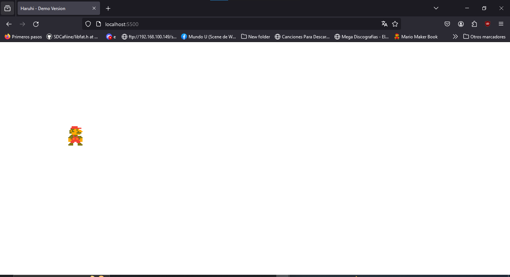

# Registro de Cambios

## HaruhiEngine v0.1b
+ Ya se pueden renderizar sprites
+ Hay un ciclo basico para la actualización de las entidades `Entity->update()`
+ Se añadio la primera versión de el RenderQueeue
+ Se añadio una forma facil de poder acceder a las pulsaciones de el teclado
+ Se agrego una base de datos local para guardar archivos de guardado o progreso.
**
Imagen de Referencia
**

## HaruhiEngine v0.2beta
+ Se pueden renderizar escenas. **(PromiseLike/sync)**
+ API de keyboard y renderer utilizable en todo tu proyecto.
+ Se agrego `Engine.changeScene()` utilizable al pasar una escena como parametro - _temporalmente se requiere que sea una escena pre-construida_
+ Ahora _keyboard_ soporta multiples teclas usando el atributo `keyborad.Holding`.
+ **Experimental!!** - Se esta trabajando en transpilar tu app a un ejecutable.
